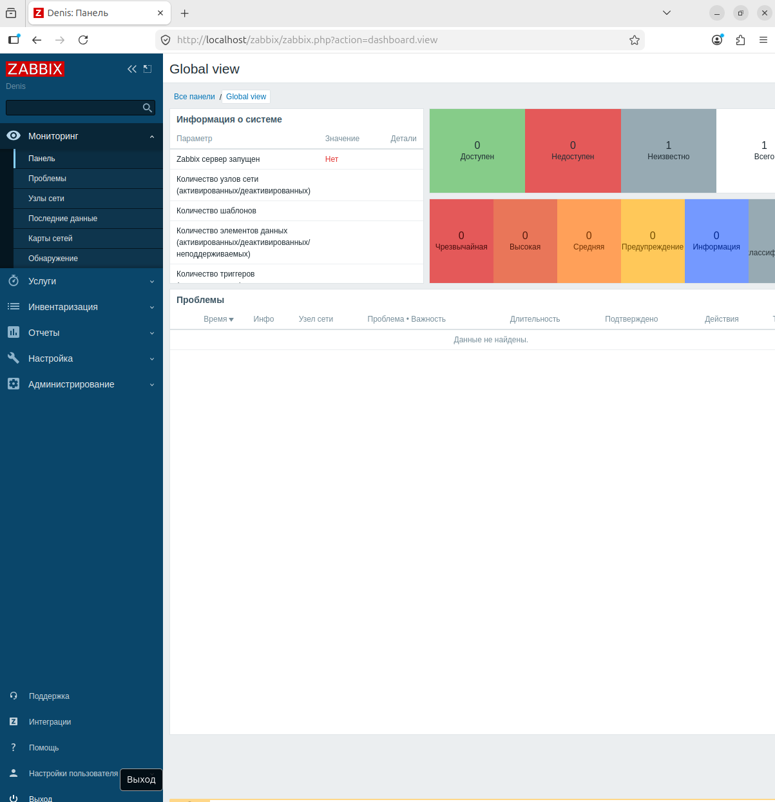
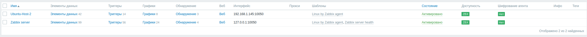
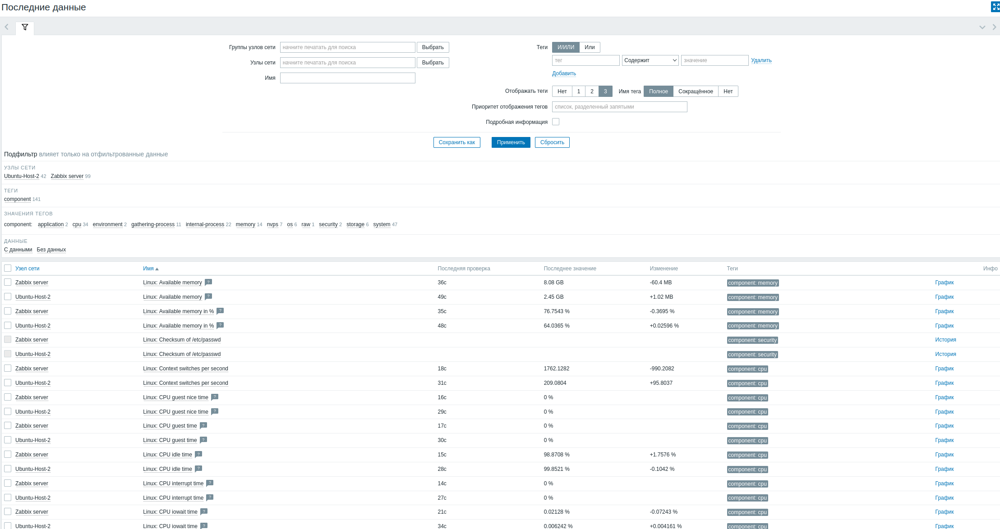
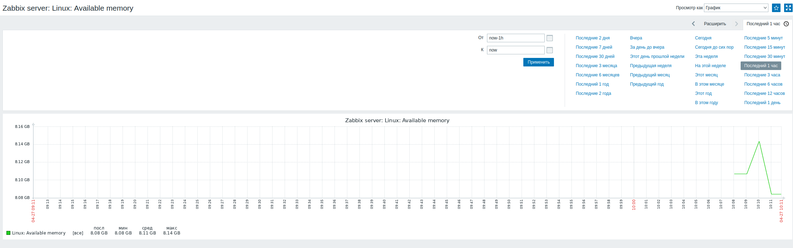
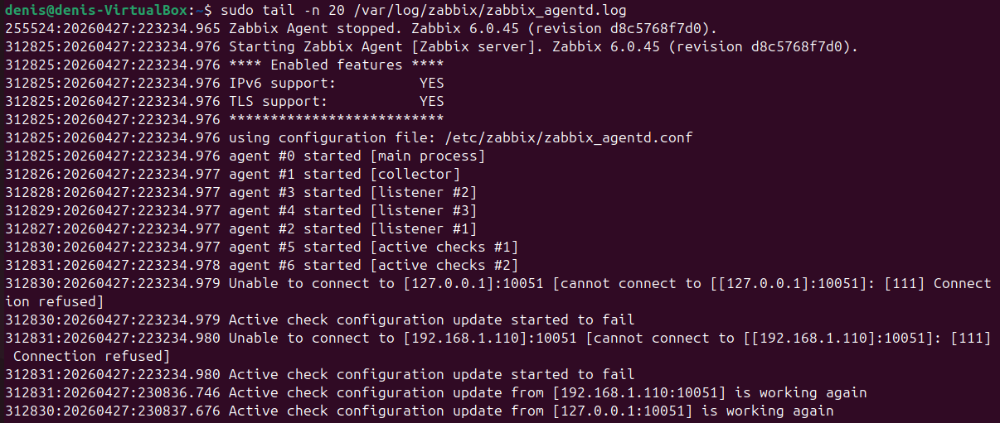

# Система мониторинга Zabbix - Мурашов Денис

## Задание 1: Установите Zabbix Server с веб-интерфейсом.

Команды:

sudo apt install postgresql -y

sudo -u postgres createuser --pwprompt zabbix
sudo -u postgres createdb -O zabbix zabbix

wget https://repo.zabbix.com/zabbix/6.0/ubuntu/pool/main/z/zabbix-release/zabbix-release_latest_6.0+ubuntu24.04_all.deb
sudo dpkg -i zabbix-release_latest_6.0+ubuntu24.04_all.deb
sudo apt update

sudo apt install postgresql zabbix-server-pgsql zabbix-frontend-php php-pgsql zabbix-apache-conf zabbix-sql-scripts zabbix-agent -y

zcat /usr/share/zabbix-sql-scripts/postgresql/server.sql.gz | sudo -u zabbix psql zabbix
sudo sed -i 's/# DBPassword=/DBPassword=12345/g' /etc/zabbix/zabbix_server.conf

sudo systemctl restart zabbix-server apache2 zabbix-agent
sudo systemctl enable zabbix-server apache2 zabbix-agent

## Задание 2: Установка Zabbix Agent.

wget https://repo.zabbix.com/zabbix/6.0/ubuntu/pool/main/z/zabbix-release/zabbix-release_6.0-4+ubuntu22.04_all.deb
sudo dpkg -i zabbix-release_6.0-4+ubuntu22.04_all.deb
sudo apt update

sudo apt install zabbix-agent -y

sudo nano /etc/zabbix/zabbix_agentd.conf
# В файле были изменены следующие параметры:
# Server=192.168.1.110          (IP-адрес Zabbix-сервера)
# ServerActive=192.168.1.110    (IP-адрес Zabbix-сервера)
# Hostname=Ubuntu-Host-2        (Имя хоста для отображения в панели)

sudo systemctl restart zabbix-agent
sudo systemctl enable zabbix-agent

sudo tail -n 20 /var/log/zabbix/zabbix_agentd.log
